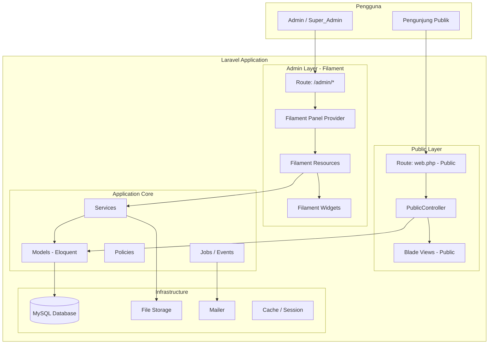
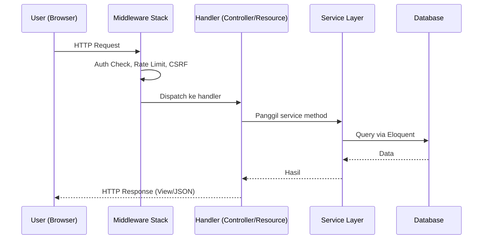
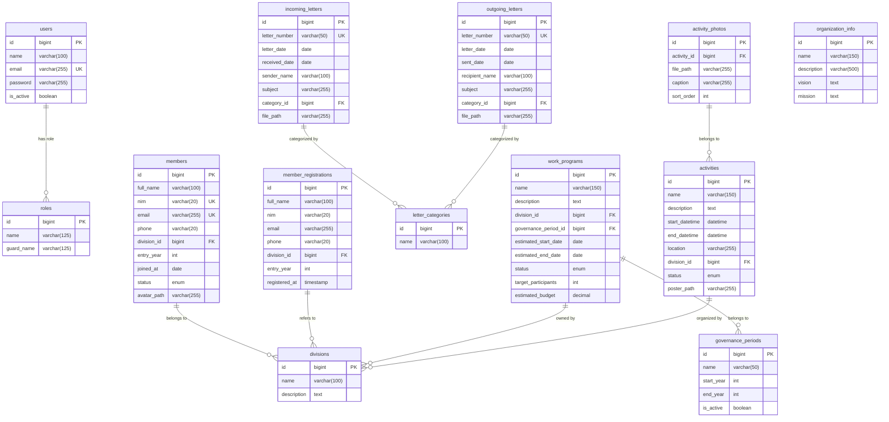

# Design Document — Website UKM SENJA

## Overview

Website UKM SENJA adalah platform digital yang melayani dua kelompok pengguna utama:

- **Pengunjung Publik** — mengakses informasi organisasi, melihat kegiatan, program kerja, dan galeri foto tanpa autentikasi.
- **Administrator (Admin / Super_Admin)** — mengelola seluruh konten melalui dashboard berbasis Filament PHP.

Tiga modul inti yang dibangun:

1. **Pendataan Anggota** — registrasi publik, CRUD admin, verifikasi, ekspor.
2. **Pengarsipan Surat Online** — surat masuk & keluar, kategori, upload PDF.
3. **Program Kerja & Kegiatan** — publikasi proker, agenda kegiatan, galeri foto.

### Keputusan Desain Utama

| Keputusan | Pilihan | Alasan |
|---|---|---|
| Admin Panel | Filament PHP v3 | Ekosistem Laravel-native, kaya fitur, customizable |
| Frontend Publik | Blade + Tailwind CSS v4 | Ringan, konsisten dengan stack yang ada |
| Design System | Custom Filament Theme | Konsistensi brand SENJA di seluruh antarmuka |
| Authorization | Spatie Laravel Permission | Role/permission yang matang dan teruji |
| Storage | Laravel Storage (local/S3-compatible) | Fleksibel untuk deployment lokal maupun cloud |
| Export | Maatwebsite Excel | De-facto standard untuk export Excel di Laravel |
| PBT Library | Pest + Eris (PHP PBT) | Testing property-based di ekosistem PHP/Laravel |

---

## Architecture

### Gambaran Arsitektur



### Pola Arsitektur

Aplikasi mengikuti pola **MVC + Service Layer**:

- **Model** — Eloquent ORM, menangani query dan relasi database.
- **Service** — Business logic yang dipanggil dari Resource Filament maupun Controller.
- **Controller** — Hanya untuk halaman publik; tipis (thin controller).
- **Resource Filament** — CRUD admin, terbagi menjadi beberapa file terpisah.
- **Policy** — Otorisasi berbasis peran menggunakan Spatie Permission.

### Alur Request



### Struktur Route

#### Route Publik

```php
// routes/web.php

Route::get('/', [HomeController::class, 'index'])->name('home');

Route::prefix('kegiatan')->name('activities.')->group(function () {
    Route::get('/', [ActivityController::class, 'index'])->name('index');
    Route::get('/{activity}', [ActivityController::class, 'show'])->name('show');
});

Route::prefix('program-kerja')->name('work-programs.')->group(function () {
    Route::get('/', [WorkProgramController::class, 'index'])->name('index');
    Route::get('/{workProgram}', [WorkProgramController::class, 'show'])->name('show');
});

Route::prefix('daftar')->name('registration.')->group(function () {
    Route::get('/', [RegistrationController::class, 'create'])->name('create');
    Route::post('/', [RegistrationController::class, 'store'])->name('store');
});
```

#### Route Admin (Filament — Auto-generated)

Filament mengelola semua route `/admin/*` secara otomatis melalui `AdminPanelProvider`:

```
GET  /admin                              → Dashboard
GET  /admin/login                        → Halaman Login Filament
POST /admin/login                        → Proses Login
POST /admin/logout                       → Logout

GET  /admin/members                      → List Anggota
GET  /admin/members/create               → Form Tambah Anggota
GET  /admin/members/{id}/edit            → Form Edit Anggota

GET  /admin/member-registrations         → List Pendaftaran
GET  /admin/member-registrations/{id}    → Detail Pendaftaran

GET  /admin/incoming-letters             → List Surat Masuk
GET  /admin/outgoing-letters             → List Surat Keluar
GET  /admin/letter-categories            → Kategori Surat

GET  /admin/work-programs                → List Proker
GET  /admin/activities                   → List Kegiatan
GET  /admin/activities/{id}/photos       → Galeri Foto

GET  /admin/users                        → List Pengguna (Super_Admin only)
GET  /admin/organization-info/edit       → Info Organisasi (Singleton)
```

---

## Components and Interfaces

### Filament Resources

| Resource | Model | Akses | Fitur Khusus |
|---|---|---|---|
| `MemberResource` | `Member` | Admin, Super_Admin | Export Excel/CSV, Search & Filter |
| `MemberRegistrationResource` | `MemberRegistration` | Admin, Super_Admin | Approve/Reject actions |
| `IncomingLetterResource` | `IncomingLetter` | Admin, Super_Admin | PDF upload, kategori filter |
| `OutgoingLetterResource` | `OutgoingLetter` | Admin, Super_Admin | PDF upload, kategori filter |
| `LetterCategoryResource` | `LetterCategory` | Admin, Super_Admin | Simple CRUD |
| `WorkProgramResource` | `WorkProgram` | Admin, Super_Admin | Filter divisi & periode |
| `ActivityResource` | `Activity` | Admin, Super_Admin | Subpage galeri foto |
| `UserResource` | `User` | Super_Admin only | Manajemen admin, role assignment |
| `OrganizationInfoResource` | `OrganizationInfo` | Super_Admin only | Singleton Resource |

### Filament Widgets

```php
// app/Filament/Pages/Dashboard.php

protected function getHeaderWidgets(): array
{
    return [
        StatsOverviewWidget::class,        // 4 kartu statistik
    ];
}

protected function getFooterWidgets(): array
{
    return [
        PendingRegistrationsWidget::class, // 5 pendaftaran terbaru
        UpcomingActivitiesWidget::class,   // 5 kegiatan mendatang
    ];
}
```

### Pemisahan Schema Form & Table

Setiap resource kompleks memiliki schema form dan table yang dipisah ke file terpisah:

```php
// app/Filament/Resources/MemberResource.php
use App\Filament\Resources\MemberResource\Forms\MemberForm;
use App\Filament\Resources\MemberResource\Tables\MemberTable;

public static function form(Form $form): Form
{
    return $form->schema(MemberForm::schema());
}

public static function table(Table $table): Table
{
    return $table
        ->columns(MemberTable::columns())
        ->filters(MemberTable::filters())
        ->actions(MemberTable::actions())
        ->bulkActions(MemberTable::bulkActions());
}
```

### Custom Actions: Approve & Reject Pendaftaran

```php
// MemberRegistrationResource/Pages/ListMemberRegistrations.php
Action::make('approve')
    ->label('Setujui')
    ->icon('heroicon-o-check-circle')
    ->color('success')
    ->action(fn ($record) => app(MemberRegistrationService::class)->approve($record))
    ->requiresConfirmation(),

Action::make('reject')
    ->label('Tolak')
    ->icon('heroicon-o-x-circle')
    ->color('danger')
    ->action(fn ($record) => app(MemberRegistrationService::class)->reject($record))
    ->requiresConfirmation(),
```

### Custom Theme Filament

#### Design System

| Token | Nilai | Penggunaan |
|---|---|---|
| **Primary** | `#EA580C` (orange-600) | Tombol utama, aksen, link aktif |
| **Secondary** | `#0F172A` (slate-900) | Background sidebar, header gelap |
| **Tertiary** | `#FBBF24` (amber-400) | Highlight, badge status |
| **Neutral** | `#64748B` (slate-500) | Teks sekunder, border |
| **Headline Font** | Outfit | Heading H1–H3 |
| **Body Font** | Plus Jakarta Sans | Teks paragraf, label, input |

#### Konfigurasi Panel Provider

```php
// app/Filament/AdminPanelProvider.php
use Filament\Support\Colors\Color;

public function panel(Panel $panel): Panel
{
    return $panel
        ->default()
        ->id('admin')
        ->path('admin')
        ->colors([
            'primary'   => Color::hex('#EA580C'),
            'secondary' => Color::hex('#0F172A'),
            'tertiary'  => Color::hex('#FBBF24'),
            'gray'      => Color::Slate,
        ])
        ->font('Outfit', provider: GoogleFontProvider::class)
        ->viteTheme('resources/css/filament/senja-theme.css');
}
```

#### Custom CSS Theme

```css
/* resources/css/filament/senja-theme.css */

@import url('https://fonts.googleapis.com/css2?family=Outfit:wght@400;500;600;700&family=Plus+Jakarta+Sans:wght@400;500;600&display=swap');

:root {
    --font-family-heading: 'Outfit', sans-serif;
    --font-family-body: 'Plus Jakarta Sans', sans-serif;
}

h1, h2, h3, .fi-header-heading {
    font-family: var(--font-family-heading);
}

body, p, label, input, .fi-input {
    font-family: var(--font-family-body);
}

/* Search bar rounded */
.fi-global-search-field input {
    border-radius: 9999px;
    padding-left: 1.25rem;
}

/* Sidebar secondary background */
.fi-sidebar {
    background-color: #0F172A;
}

.fi-sidebar-nav-item-active {
    background-color: #EA580C;
}
```

### Komponen Blade Publik

```
resources/views/
├── layouts/
│   └── public.blade.php              -- Layout utama: header, main, footer
├── components/
│   ├── nav/
│   │   └── public-navbar.blade.php   -- Logo + navigasi utama
│   ├── cards/
│   │   ├── activity-card.blade.php   -- Card preview kegiatan
│   │   └── work-program-card.blade.php -- Card preview proker
│   └── gallery/
│       └── lightbox-gallery.blade.php -- Grid foto + GLightbox
└── pages/
    ├── home.blade.php
    ├── activities/
    │   ├── index.blade.php
    │   └── show.blade.php
    ├── work-programs/
    │   ├── index.blade.php
    │   └── show.blade.php
    └── registration/
        └── create.blade.php
```

### Filament Form Fields

| Field | Penggunaan |
|---|---|
| `TextInput` | Nama, NIM, email, nomor telepon, nomor surat |
| `Textarea` | Deskripsi panjang |
| `Select` | Divisi, status, kategori surat, periode kepengurusan |
| `DatePicker` | Tanggal bergabung, tanggal surat |
| `DateTimePicker` | Tanggal mulai/selesai kegiatan (dengan jam) |
| `FileUpload` | Foto profil, poster kegiatan, PDF surat, foto galeri |
| `TextInput::numeric()` | Target peserta, estimasi anggaran |
| `Toggle` | Status aktif akun pengguna |

### Filament Table Columns

| Column | Penggunaan |
|---|---|
| `TextColumn` | Nama, NIM, email, nomor surat, perihal |
| `BadgeColumn` | Status (anggota, proker, kegiatan) — warna berbeda per status |
| `ImageColumn` | Foto profil anggota |
| `IconColumn` | Ketersediaan file PDF surat |
| `DateColumn` | Tanggal bergabung, tanggal surat |

### Filter & Global Search

```php
// Contoh di MemberTable.php
public static function filters(): array
{
    return [
        SelectFilter::make('division_id')
            ->relationship('division', 'name')
            ->label('Divisi'),
        SelectFilter::make('status')
            ->options(MemberStatus::options())
            ->label('Status'),
    ];
}

// Di MemberResource.php
public static function getGloballySearchableAttributes(): array
{
    return ['full_name', 'nim', 'email'];
}
```

---

## Data Models

### Diagram ERD



### Detail Tabel

#### `users`
| Kolom | Tipe | Constraint | Keterangan |
|---|---|---|---|
| `id` | BIGINT UNSIGNED | PK, AUTO_INCREMENT | |
| `name` | VARCHAR(100) | NOT NULL | Nama lengkap admin |
| `email` | VARCHAR(255) | NOT NULL, UNIQUE | Email login |
| `email_verified_at` | TIMESTAMP | NULLABLE | |
| `password` | VARCHAR(255) | NOT NULL | Bcrypt hash |
| `is_active` | BOOLEAN | NOT NULL, DEFAULT TRUE | Status akun |

#### `members`
| Kolom | Tipe | Constraint | Keterangan |
|---|---|---|---|
| `id` | BIGINT UNSIGNED | PK | |
| `full_name` | VARCHAR(100) | NOT NULL | |
| `nim` | VARCHAR(20) | NOT NULL, UNIQUE | Nomor Induk Mahasiswa |
| `email` | VARCHAR(255) | NOT NULL, UNIQUE | |
| `phone` | VARCHAR(20) | NOT NULL | |
| `division_id` | BIGINT UNSIGNED | FK → divisions.id | |
| `entry_year` | YEAR | NOT NULL | Tahun angkatan |
| `joined_at` | DATE | NOT NULL | Tanggal bergabung resmi |
| `status` | ENUM | NOT NULL | `Aktif`, `Tidak Aktif`, `Alumni` |
| `avatar_path` | VARCHAR(255) | NULLABLE | Path relatif storage |

#### `member_registrations`
| Kolom | Tipe | Constraint | Keterangan |
|---|---|---|---|
| `id` | BIGINT UNSIGNED | PK | |
| `full_name` | VARCHAR(100) | NOT NULL | |
| `nim` | VARCHAR(20) | NOT NULL | Dicek runtime terhadap members + registrations |
| `email` | VARCHAR(255) | NOT NULL | |
| `phone` | VARCHAR(20) | NOT NULL | |
| `division_id` | BIGINT UNSIGNED | FK → divisions.id | |
| `entry_year` | YEAR | NOT NULL | |
| `registered_at` | TIMESTAMP | NOT NULL | Waktu pendaftaran |

#### `incoming_letters`
| Kolom | Tipe | Constraint | Keterangan |
|---|---|---|---|
| `id` | BIGINT UNSIGNED | PK | |
| `letter_number` | VARCHAR(50) | NOT NULL, UNIQUE | Nomor surat |
| `letter_date` | DATE | NOT NULL | Tanggal surat |
| `received_date` | DATE | NOT NULL | Tanggal diterima |
| `sender_name` | VARCHAR(100) | NOT NULL | |
| `subject` | VARCHAR(255) | NOT NULL | Perihal |
| `category_id` | BIGINT UNSIGNED | FK → letter_categories.id | |
| `file_path` | VARCHAR(255) | NULLABLE | Path PDF |

#### `outgoing_letters`
| Kolom | Tipe | Constraint | Keterangan |
|---|---|---|---|
| `id` | BIGINT UNSIGNED | PK | |
| `letter_number` | VARCHAR(50) | NOT NULL, UNIQUE | |
| `letter_date` | DATE | NOT NULL | |
| `sent_date` | DATE | NOT NULL | Tanggal dikirim |
| `recipient_name` | VARCHAR(100) | NOT NULL | |
| `subject` | VARCHAR(255) | NOT NULL | |
| `category_id` | BIGINT UNSIGNED | FK → letter_categories.id | |
| `file_path` | VARCHAR(255) | NULLABLE | |

#### `work_programs`
| Kolom | Tipe | Constraint | Keterangan |
|---|---|---|---|
| `id` | BIGINT UNSIGNED | PK | |
| `name` | VARCHAR(150) | NOT NULL | Nama proker |
| `description` | TEXT | NOT NULL | |
| `division_id` | BIGINT UNSIGNED | FK → divisions.id | |
| `governance_period_id` | BIGINT UNSIGNED | FK → governance_periods.id | |
| `estimated_start_date` | DATE | NOT NULL | |
| `estimated_end_date` | DATE | NOT NULL | Harus ≥ estimated_start_date |
| `status` | ENUM | NOT NULL | `Direncanakan`, `Sedang Berjalan`, `Selesai`, `Dibatalkan` |
| `target_participants` | INT UNSIGNED | NULLABLE | ≥ 1 |
| `estimated_budget` | DECIMAL(15,2) | NULLABLE | ≥ 0 |

#### `activities`
| Kolom | Tipe | Constraint | Keterangan |
|---|---|---|---|
| `id` | BIGINT UNSIGNED | PK | |
| `name` | VARCHAR(150) | NOT NULL | |
| `description` | TEXT | NOT NULL | |
| `start_datetime` | DATETIME | NOT NULL | |
| `end_datetime` | DATETIME | NOT NULL | Harus > start_datetime |
| `location` | VARCHAR(255) | NOT NULL | |
| `division_id` | BIGINT UNSIGNED | FK → divisions.id | |
| `status` | ENUM | NOT NULL | `Akan Datang`, `Sedang Berlangsung`, `Selesai`, `Dibatalkan` |
| `poster_path` | VARCHAR(255) | NULLABLE | |

#### `activity_photos`
| Kolom | Tipe | Constraint | Keterangan |
|---|---|---|---|
| `id` | BIGINT UNSIGNED | PK | |
| `activity_id` | BIGINT UNSIGNED | FK → activities.id, CASCADE DELETE | |
| `file_path` | VARCHAR(255) | NOT NULL | |
| `caption` | VARCHAR(255) | NULLABLE | |
| `sort_order` | INT | NOT NULL, DEFAULT 0 | Urutan tampil |

#### `letter_categories`
| Kolom | Tipe | Constraint |
|---|---|---|
| `id` | BIGINT UNSIGNED | PK |
| `name` | VARCHAR(100) | NOT NULL, UNIQUE |

Default seeder: `Undangan`, `SK (Surat Keputusan)`, `Permohonan`, `Pemberitahuan`, `Umum`.

### Struktur File & Folder

```
app/
├── Filament/
│   ├── AdminPanelProvider.php
│   ├── Resources/
│   │   ├── MemberResource.php
│   │   ├── MemberResource/
│   │   │   ├── Pages/
│   │   │   │   ├── ListMembers.php
│   │   │   │   ├── CreateMember.php
│   │   │   │   └── EditMember.php
│   │   │   ├── Forms/
│   │   │   │   └── MemberForm.php
│   │   │   └── Tables/
│   │   │       └── MemberTable.php
│   │   ├── MemberRegistrationResource.php
│   │   ├── MemberRegistrationResource/
│   │   │   └── Pages/
│   │   │       ├── ListMemberRegistrations.php
│   │   │       └── ViewMemberRegistration.php
│   │   ├── IncomingLetterResource.php
│   │   ├── IncomingLetterResource/
│   │   │   ├── Pages/
│   │   │   │   ├── ListIncomingLetters.php
│   │   │   │   ├── CreateIncomingLetter.php
│   │   │   │   └── EditIncomingLetter.php
│   │   │   ├── Forms/
│   │   │   │   └── IncomingLetterForm.php
│   │   │   └── Tables/
│   │   │       └── IncomingLetterTable.php
│   │   ├── OutgoingLetterResource.php
│   │   ├── OutgoingLetterResource/
│   │   │   ├── Pages/ (sama dengan Incoming)
│   │   │   ├── Forms/
│   │   │   │   └── OutgoingLetterForm.php
│   │   │   └── Tables/
│   │   │       └── OutgoingLetterTable.php
│   │   ├── LetterCategoryResource.php
│   │   ├── WorkProgramResource.php
│   │   ├── WorkProgramResource/
│   │   │   ├── Pages/ (List, Create, Edit)
│   │   │   ├── Forms/
│   │   │   │   └── WorkProgramForm.php
│   │   │   └── Tables/
│   │   │       └── WorkProgramTable.php
│   │   ├── ActivityResource.php
│   │   ├── ActivityResource/
│   │   │   ├── Pages/
│   │   │   │   ├── ListActivities.php
│   │   │   │   ├── CreateActivity.php
│   │   │   │   ├── EditActivity.php
│   │   │   │   └── ManageActivityPhotos.php
│   │   │   ├── Forms/
│   │   │   │   └── ActivityForm.php
│   │   │   └── Tables/
│   │   │       └── ActivityTable.php
│   │   ├── UserResource.php
│   │   ├── UserResource/
│   │   │   └── Pages/
│   │   │       ├── ListUsers.php
│   │   │       ├── CreateUser.php
│   │   │       └── EditUser.php
│   │   └── OrganizationInfoResource.php   -- Singleton
│   ├── Widgets/
│   │   ├── StatsOverviewWidget.php
│   │   ├── PendingRegistrationsWidget.php
│   │   └── UpcomingActivitiesWidget.php
│   └── Pages/
│       └── Dashboard.php
├── Http/
│   ├── Controllers/
│   │   └── Public/
│   │       ├── HomeController.php
│   │       ├── ActivityController.php
│   │       ├── WorkProgramController.php
│   │       └── RegistrationController.php
│   ├── Middleware/
│   │   └── RateLimitLoginMiddleware.php
│   └── Requests/
│       └── Public/
│           └── MemberRegistrationRequest.php
├── Models/
│   ├── User.php
│   ├── Member.php
│   ├── MemberRegistration.php
│   ├── Division.php
│   ├── GovernancePeriod.php
│   ├── IncomingLetter.php
│   ├── OutgoingLetter.php
│   ├── LetterCategory.php
│   ├── WorkProgram.php
│   ├── Activity.php
│   ├── ActivityPhoto.php
│   └── OrganizationInfo.php
├── Policies/
│   ├── UserPolicy.php
│   ├── MemberPolicy.php
│   ├── LetterPolicy.php
│   ├── WorkProgramPolicy.php
│   └── ActivityPolicy.php
├── Services/
│   ├── MemberService.php
│   ├── LetterService.php
│   ├── WorkProgramService.php
│   ├── ActivityService.php
│   └── MemberRegistrationService.php
└── Providers/
    └── AppServiceProvider.php
```

---

## Correctness Properties

*Sebuah property adalah karakteristik atau perilaku yang harus benar di seluruh eksekusi sistem yang valid — pada dasarnya, pernyataan formal tentang apa yang seharusnya dilakukan oleh sistem. Properties menjembatani antara spesifikasi yang dapat dibaca manusia dengan jaminan kebenaran yang dapat diverifikasi secara otomatis.*

### Property 1: Proteksi Rute Admin

*Untuk semua* rute yang berada di bawah `/admin/*`, sistem SHALL mengembalikan redirect ke halaman login ketika diakses tanpa autentikasi. Tidak ada satu pun rute admin yang boleh dapat diakses secara langsung tanpa sesi yang valid.

**Validates: Requirements 1.4, 1.5**

---

### Property 2: Rate Limiting Login

*Untuk semua* urutan percobaan login yang gagal dari IP yang sama, pemblokiran SHALL aktif tepat setelah percobaan ke-5 dalam rentang 10 menit. Sistem tidak boleh memblokir lebih awal (sebelum 5 kali) dan tidak boleh membiarkan akses setelah 5 kali gagal.

**Validates: Requirements 1.6**

---

### Property 3: Integritas Data Anggota (Round-Trip)

*Untuk semua* data anggota baru yang valid (nama lengkap, NIM unik, email unik, telepon, divisi, angkatan, tanggal bergabung, status), menyimpan lalu membacanya kembali dari database SHALL menghasilkan data yang identik dengan data yang dimasukkan — tidak ada field yang hilang atau berubah.

**Validates: Requirements 3.2, 3.8**

---

### Property 4: Keunikan NIM Lintas Tabel

*Untuk semua* NIM yang sudah terdaftar di tabel `members` atau terdapat di daftar `member_registrations` yang aktif, mencoba mendaftarkan anggota baru atau mengirimkan pendaftaran baru dengan NIM yang sama SHALL selalu menghasilkan penolakan — tidak pernah berhasil tersimpan.

**Validates: Requirements 3.4, 4.4**

---

### Property 5: Pencarian Anggota Bersifat Case-Insensitive dan Parsial

*Untuk semua* kata kunci pencarian `q` dan daftar anggota yang ada, setiap anggota yang dikembalikan dari pencarian berdasarkan nama atau NIM SHALL mengandung `q` (pencocokan parsial, tidak sensitif huruf besar/kecil). Sebaliknya, tidak ada anggota yang dikembalikan yang tidak mengandung `q`.

**Validates: Requirements 3.9**

---

### Property 6: Filter Menghasilkan Subset yang Seluruhnya Valid

*Untuk semua* kombinasi filter (divisi, status), setiap anggota yang dikembalikan dalam hasil filter SHALL memenuhi SEMUA kriteria filter yang diterapkan secara bersamaan. Tidak ada hasil yang melanggar salah satu kriteria filter.

**Validates: Requirements 3.10, 6.8**

---

### Property 7: Pendaftaran Pengunjung Selalu Tersimpan sebagai "Menunggu Verifikasi"

*Untuk semua* data pendaftaran anggota yang valid yang dikirimkan oleh pengunjung, status entri yang tersimpan SHALL selalu `Menunggu Verifikasi` — tidak pernah langsung `Aktif` atau status lainnya tanpa persetujuan admin.

**Validates: Requirements 4.2**

---

### Property 8: Approval Pendaftaran Menghasilkan Anggota Aktif dan Menghapus Antrian

*Untuk semua* entri pendaftaran yang berstatus `Menunggu Verifikasi`, ketika admin menyetujuinya, sistem SHALL (1) membuat tepat satu anggota baru dengan status `Aktif` yang memiliki data identik dengan pendaftaran, dan (2) menghapus entri pendaftaran tersebut dari daftar tunggu.

**Validates: Requirements 4.5**

---

### Property 9: Keunikan Nomor Surat Bersifat Lokal Per Jenis

*Untuk semua* pasangan (nomor_surat, jenis_surat), nomor surat yang sama SHALL selalu ditolak jika sudah ada pada jenis surat yang sama (masuk atau keluar). Namun, nomor surat yang sama pada jenis berbeda (satu di surat masuk, satu di surat keluar) SHALL diterima.

**Validates: Requirements 5.4**

---

### Property 10: Validasi Tanggal Selesai Tidak Boleh Lebih Awal dari Tanggal Mulai

*Untuk semua* formulir proker atau kegiatan dengan `tanggal_selesai < tanggal_mulai`, sistem SHALL selalu mengembalikan error validasi dan tidak menyimpan data apapun. Properti ini berlaku tanpa terkecuali untuk semua pasangan tanggal yang mungkin.

**Validates: Requirements 6.3, 7.3**

---

### Property 11: Halaman Publik Hanya Menampilkan Entri Aktif yang Terurut

*Untuk semua* kondisi data proker atau kegiatan yang ada (berbagai status, berbagai jumlah), halaman publik SHALL hanya menampilkan entri dengan status aktif (`Direncanakan`/`Sedang Berjalan` untuk proker; `Akan Datang`/`Sedang Berlangsung` untuk kegiatan), diurutkan berdasarkan tanggal mulai secara menaik. Entri berstatus `Selesai` atau `Dibatalkan` tidak boleh muncul.

**Validates: Requirements 6.6, 7.8**

---

### Property 12: Validasi File Upload Konsisten di Seluruh Modul

*Untuk semua* file yang diunggah ke modul manapun (foto profil, poster, foto galeri), sistem SHALL menolak file yang tidak memenuhi kriteria format (harus JPG/PNG/WebP) ATAU ukuran melebihi batas yang ditetapkan. File yang memenuhi kriteria SHALL selalu diterima.

**Validates: Requirements 7.5, 10.2, 10.3**

---

### Property 13: Statistik Dashboard Selalu Akurat

*Untuk semua* kondisi database (0 hingga N entri untuk setiap entitas), nilai yang ditampilkan di kartu statistik dashboard SHALL selalu sama dengan hasil `COUNT` aktual dari query database pada saat itu — tidak ada nilai yang stale dari cache yang tidak sinkron.

**Validates: Requirements 8.2, 8.3, 8.4**

---

### Property 14: Operasi Manajemen Akun Ditolak untuk Non-Super_Admin

*Untuk semua* operasi manajemen akun (tambah, nonaktifkan, aktifkan, hapus), operasi tersebut SHALL selalu gagal dengan error otorisasi ketika dijalankan oleh pengguna dengan role `Admin` (bukan `Super_Admin`). Tidak ada satu pun operasi manajemen akun yang bisa berhasil dilakukan oleh non-Super_Admin.

**Validates: Requirements 9.4**

---

### Property 15: Invariant Keberadaan Super_Admin Aktif

*Untuk semua* kondisi sistem dimana hanya tersisa tepat satu Super_Admin yang aktif, setiap percobaan untuk menghapus atau menonaktifkan akun tersebut SHALL selalu ditolak. Sistem tidak pernah boleh berada dalam keadaan tanpa Super_Admin aktif.

**Validates: Requirements 9.5**

---

## Error Handling

### Strategi Penanganan Error

#### Validasi Input

Semua validasi dilakukan di dua lapisan:

1. **Client-side** — HTML5 form validation + JavaScript untuk UX yang responsif.
2. **Server-side** — Laravel Form Request / Filament validation (selalu menjadi sumber kebenaran).

```php
// Contoh MemberRegistrationRequest.php
public function rules(): array
{
    return [
        'full_name' => ['required', 'string', 'max:100'],
        'nim'       => [
            'required',
            'string',
            'max:20',
            Rule::unique('members', 'nim'),
            Rule::unique('member_registrations', 'nim'),
        ],
        'email'     => ['required', 'email', 'max:255', 'unique:members,email'],
        'phone'     => ['required', 'string', 'max:20'],
        'division_id' => ['required', 'exists:divisions,id'],
        'entry_year'  => ['required', 'digits:4', 'integer', 'min:2000'],
    ];
}

public function messages(): array
{
    return [
        'nim.unique'   => 'NIM ini sudah terdaftar sebagai anggota atau sedang menunggu verifikasi.',
        'email.unique' => 'Email ini sudah terdaftar.',
    ];
}
```

#### Error HTTP

| Kode | Kondisi | Respons |
|---|---|---|
| 401 | Tidak terautentikasi di rute admin | Redirect ke `/admin/login` |
| 403 | Tidak punya izin (mis. Admin akses UserResource) | Halaman 403 Forbidden |
| 404 | Resource tidak ditemukan | Halaman 404 Not Found |
| 422 | Validasi gagal (form) | Kembali ke form dengan error messages |
| 429 | Rate limit login terlampaui | Pesan blokir, form disabled 15 menit |
| 500 | Error server tidak terduga | Halaman 500, log ke `storage/logs` |

#### Penanganan File Upload

```php
// Jika file upload gagal (ukuran/format tidak valid)
// Filament otomatis menampilkan error validation di samping field
// File yang invalid tidak disimpan; file lain dalam batch yang sama tetap diproses (untuk multi-upload galeri)
```

#### Cascade Delete

Saat Admin menghapus `Activity`, sistem secara otomatis menghapus semua `ActivityPhoto` terkait beserta file fisiknya di storage, via model event:

```php
// app/Models/Activity.php
protected static function booted(): void
{
    static::deleting(function (Activity $activity) {
        $activity->photos->each(function (ActivityPhoto $photo) {
            Storage::disk('public')->delete($photo->file_path);
        });
    });
}
```

#### Nonaktifkan Admin: Revoke Sesi

```php
// app/Services/UserService.php
public function deactivate(User $user): void
{
    $user->update(['is_active' => false]);
    // Hapus semua sesi aktif milik user ini
    DB::table('sessions')
        ->where('user_id', $user->id)
        ->delete();
}
```

---

## Testing Strategy

### Pendekatan Dual Testing

Pengujian menggunakan dua pendekatan komplementer:

1. **Feature/Unit Tests** — contoh konkret, edge case, error conditions, integrasi antar komponen.
2. **Property-Based Tests** — verifikasi properties universal di atas sejumlah besar input yang di-generate secara acak.

### Library & Tools

| Tool | Peran |
|---|---|
| **Pest PHP v3** | Test runner utama dengan sintaks ekspresif |
| **widmogrod/php-functional (Eris)** | Library property-based testing untuk PHP |
| **Mockery** | Mocking dependencies (sudah ada di composer.json) |
| **Laravel Factories** | Generate test data |

Instalasi:
```bash
composer require --dev pestphp/pest:"^3.0" pestphp/pest-plugin-laravel:"^3.0"
composer require --dev widmogrod/php-functional
```

### Konfigurasi Property Tests

Setiap property test HARUS:
- Dijalankan minimal **100 iterasi** per property.
- Diberi komentar tag yang referensi ke property dalam design document.
- Format tag: `// Feature: senja-website, Property {N}: {judul_property}`

Contoh struktur:

```php
// tests/Properties/MemberPropertyTest.php

use function Eris\Generator\string;
use function Eris\Generator\choose;

// Feature: senja-website, Property 4: Keunikan NIM Lintas Tabel
it('menolak NIM yang sudah terdaftar di members atau registrations', function () {
    // Generate NIM yang sudah ada, coba tambah → harus selalu gagal
})->repeat(100);

// Feature: senja-website, Property 3: Integritas Data Anggota (Round-Trip)
it('menyimpan dan membaca anggota menghasilkan data identik', function () {
    // Generate data anggota valid, simpan, baca, bandingkan
})->repeat(100);
```

### Coverage per Requirement

| Requirement | Tipe Test Utama | Test File |
|---|---|---|
| Req 1 (Auth + Rate Limit) | Feature + Property | `AdminAuthTest.php`, `Properties/AuthPropertyTest.php` |
| Req 2 (Halaman Publik) | Feature (Example + Smoke) | `HomePageTest.php` |
| Req 3 (Anggota Admin) | Feature + Property | `MemberManagementTest.php`, `Properties/MemberPropertyTest.php` |
| Req 4 (Pendaftaran Publik) | Feature + Property | `RegistrationTest.php`, `Properties/MemberPropertyTest.php` |
| Req 5 (Arsip Surat) | Feature + Property | `LetterArchiveTest.php`, `Properties/LetterPropertyTest.php` |
| Req 6 (Proker) | Feature + Property | `WorkProgramTest.php`, `Properties/WorkProgramPropertyTest.php` |
| Req 7 (Kegiatan) | Feature + Property | `ActivityTest.php`, `Properties/ActivityPropertyTest.php` |
| Req 8 (Dashboard) | Feature + Property | `DashboardTest.php` |
| Req 9 (User Management) | Feature + Property | `UserManagementTest.php` |
| Req 10 (Galeri Foto) | Feature | `ActivityTest.php` |

### Unit vs Property vs Integration

- **Property tests** digunakan untuk semua kriteria yang telah dianalisis sebagai `PROPERTY` di prework.
- **Feature/Example tests** digunakan untuk kriteria `EXAMPLE`, `SMOKE`, dan `EDGE_CASE`.
- **Integration tests** digunakan untuk kriteria `INTEGRATION` (mis. ekspor Excel, pengiriman email).
- **Browser tests (Dusk)** opsional untuk verifikasi UI seperti lightbox dan navigasi.
